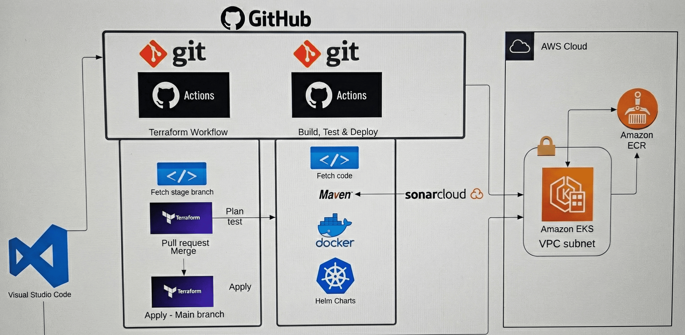

# Monil's Github Action Notes !

<br>

## The Magic of Automation

#### CI/CD Workflow directly in GitHub — No extra manual setup like Jenkins required!

#### Core Concepts

| Term | Definition |
|------|------------|
| **Workflow** | Automated CI/CD process (defined in YAML) |
| **Job** | Set of steps, runs on a runner |
| **Step** | Single task (run script or use action) |
| **Action** | Reusable piece of automation (Import/Use) |
| **Runner** | Server where jobs run |

#### Important Note
> Artifacts created in the workflow are **destroyed** as soon as the CI/CD workflow is completed/deployed.
> You must include a job to store them (e.g., to ECR, S3, etc.).

<br>
<br>

## Syntax & Keywords

#### Every workflow must be saved in:
```bash
.github/workflows/ci-cd.yaml
```

#### Triggers the workflow (push, pull_request, schedule, workflow_dispatch)
```yaml
on:
```

#### Global environment variables
```yaml
env:
  VARIABLE_NAME: value
# Accessed via: ${{ env.VARIABLE_NAME }}
```

#### Choose the OS and VM type for the runner
```yaml
runs-on: ubuntu-latest
```

#### Requires the mentioned job to complete before this job runs
```yaml
needs: job-name
```

#### Step keywords — name, run, uses, with
```yaml
steps:
  - name: Step name         # Label for the step
    run: shell command      # Run shell commands (single or multiline)
    uses: action@version    # Run a reusable GitHub Action
    with:                   # Pair with 'uses' to provide inputs
      input-key: value
```

<br>
<br>

## Workflow Structure Example

```yaml
name: CI-CD pipeline
on:
  push:
    branches: [main]

jobs:
  job-name:
    runs-on: ubuntu-latest
    steps:
      - name: Step name
        uses: actions/checkout@v4
      - name: Step name
        run: command

  job-2:
    needs: job-name
    steps: ...
```

<br>
<br>

## Full CI/CD Pipeline (Build → Push → Deploy)

#### Environment Variables used across all jobs
```yaml
env:
  AWS_REGION: ap-south-1
  ECR_REPOSITORY: my-app
  IMAGE_NAME: my-app
```

<br>

### Job 1: Build & Test (Maven)

```yaml
build-test:
    name: Build & Test (Maven)
    runs-on: ubuntu-latest

    steps:
      - name: Checkout code
        uses: actions/checkout@v4

      - name: Set up JDK
        uses: actions/setup-java@v4
        with:
          distribution: temurin
          java-version: '17'
          cache: maven

      - name: Build and test with Maven
        run: mvn -B clean verify
```

<br>

### Job 2: Build & Push to Docker / ECR

```yaml
  build-push:
    name: Build & Push to ECR
    runs-on: ubuntu-latest
    needs: build-test
    if: github.event_name == 'push'

    steps:
      - name: Checkout code
        uses: actions/checkout@v4

      - name: Configure AWS Credentials
        uses: aws-actions/configure-aws-credentials@v4
        with:
          role-to-assume: ${{ secrets.AWS_ROLE_ARN }}
          aws-region: ${{ env.AWS_REGION }}

      - name: Login to Amazon ECR
        id: ecr-login
        uses: aws-actions/amazon-ecr-login@v2

      - name: Set up Docker Buildx
        uses: docker/setup-buildx-action@v3

      - name: Build and Push Image
        uses: docker/build-push-action@v5
        with:
          context: .
          push: true
          tags: ${{ steps.ecr-login.outputs.registry }}/${{ env.ECR_REPOSITORY }}:${{ github.sha }}
          cache-from: type=gha
          cache-to: type=gha,mode=max

      - name: Save Image Metadata
        run: echo "${{ steps.ecr-login.outputs.registry }}/${{ env.ECR_REPOSITORY }}:${{ github.sha }}" > image.txt

      - name: Upload Image Artifact
        uses: actions/upload-artifact@v4
        with:
          name: docker-image
          path: image.txt
```

<br>

### Job 3: Deploy to Kubernetes (EKS)

```yaml
deploy:
    name: Deploy to EKS
    runs-on: ubuntu-latest
    needs: build-push
    if: github.event_name == 'push'

    steps:
      - name: Checkout code
        uses: actions/checkout@v4

      - name: Download Image Artifact
        uses: actions/download-artifact@v4
        with:
          name: docker-image

      - name: Read Image Metadata
        run: echo "IMAGE=$(cat image.txt)" >> "$GITHUB_ENV"

      - name: Configure AWS Credentials
        uses: aws-actions/configure-aws-credentials@v4
        with:
          role-to-assume: ${{ secrets.AWS_ROLE_ARN }}
          aws-region: ${{ env.AWS_REGION }}

      - name: Update kubeconfig
        run: aws eks update-kubeconfig --name "${{ secrets.EKS_CLUSTER_NAME }}" --region "${{ env.AWS_REGION }}"

      - name: Set image in deployment manifest
        run: sed -i "s|IMAGE_PLACEHOLDER|${IMAGE}|g" k8s/deployment.yaml

      - name: Apply Kubernetes manifests
        run: kubectl apply -f k8s/

      - name: Check rollout status
        run: kubectl rollout status deployment/myapp
```

<br>
<br>

## GitOps

#### What is GitOps?
> GitOps = **Git** (Versioning) + **Ops** (Operational Tasks)
> It is a **subset of DevOps** where everything is managed as code in Git.

**If it's not in Git, it doesn't exist.**

#### Why GitOps?
- **Security:** Restricts direct access to infrastructure — everything goes through Git
- **Auditability:** Every change is a Git commit with a full history
- **Tools:** GitHub Actions, GitLab, ArgoCD, Kubernetes

<br>
<br>

## GitOps Workflow

#### Step 1 — Write & Push Code to Git
```
Source code + YAML files → pushed to GitHub / GitLab
```

#### Step 2 — CI Tools (GitHub Actions / GitLab)
```
Run Tests → Build Docker Image → Push to Registry
CI also updates deployment YAML files and commits them back to the repo
```

#### Step 3 — GitOps Controller (ArgoCD / Flux)
```
Continuously monitors repo for changes
Auto-applies changes to the K8s cluster as soon as detected
```

#### Step 4 — Kubernetes Environment (AKS / EKS / GKE)
```
Actual cluster runs here
Auto Sync + Drift Detection + Rollback:
If someone manually changes a config (outside of Git),
ArgoCD detects it and heals back to the repo's configuration
```

<br>
<br>

## GitOps Project Architecture




#### Full End-to-End Flow

```
Developer
    │
    ▼
GitHub (Code Branch)
    │
    ├── GitHub Actions (CI)
    │       ├── Fetch Code
    │       ├── Maven → Build & Test
    │       ├── SonarQube → Code Quality
    │       ├── Docker Build
    │       └── Push Image → Amazon ECR
    │
    ├── GitHub Actions (Infrastructure)
    │       ├── Terraform Plan
    │       ├── Terraform Apply
    │       └── Provisions → VPC, Subnets, EKS on AWS
    │
    └── GitHub (GitOps Branch)
            ├── Helm Charts updated in repo
            └── ArgoCD (running in EKS)
                    └── Syncs & Deploys → EKS Cluster
```

